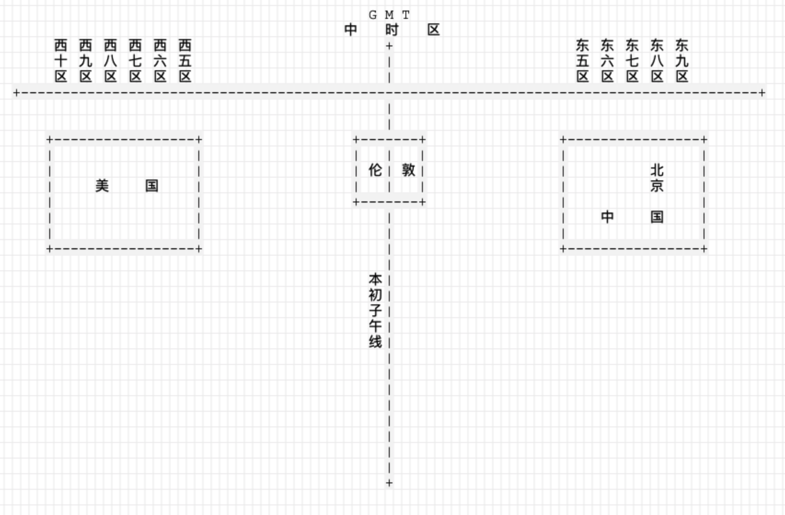

# 时区
## 常见概念
### 理论时区
强制以15度为范围划分的时区。
### 法定时区
一些比较大的国家，跨多个时区，则以国家内部行政分界线作为时区。
### 世界时
以平子夜作为0时开始的格林威治平太阳时，称为世界时（简称UT）。
世界时是由恒星时推导出来的。由于地球自转速度变化的影响，它不是一种均匀的时间系统。
### 原子时
原子时秒的定义 [2]  ：铯 -133 原子基态的两个超精细能级间在零磁场下跃迁辐射9,192,631,770周所持续的时间。
在确定原子时起点之后，由于地球自转速度不均匀，世界时与原子时之间的时差便逐年积累。
现在原子时已经作为基本的时间计量单位。
### UTC
全称(Universal Time Coordinated)世界协调时；协调世界时是以原子时秒长为基础，在时刻上尽量接近于世界时的一种时间计量系统。
UTC时间常见的表达方式: “09:30 UTC”就写作“09:30Z”或是“0930Z”。
### GMT
格林尼治标准时间（Greenwich Mean Time，GMT）是指位于伦敦郊区的皇家格林尼治天文台的标准时间，因为本初子午线被定义在通过那里的经线。
理论上来说，格林尼治标准时间的正午是指当太阳横穿格林尼治子午线时的时间。由于地球在它的椭圆轨道里的运动速度不均匀，这个时刻可能和实际的太阳时相差16分钟。 地球每天的自转是有些不规则的，而且正在缓慢减速。所以，格林尼治时间已经不再被作为标准时间使用。如今的标准时间——协调世界时（UTC）——由原子钟提供。 自1924年2月5日开始，格林尼治天文台每隔一小时会向全世界发放调时信息。而UTC是基于标准的GMT提供的准确时间。
在不需要精确到秒的情况下，通常将GMT 和UTC 视作等同。但UTC 更加科学更加精确，它是以原子时为基础，在时刻上尽量接近世界时的一种时间计量系统。它的出现是现代社会对于精确计时的需要。

## 图解

## 冬令时和夏令时
### 概念
冬令时和夏令时是当地的标准时间。有冬令时就会有夏令时。大概在每年的3月的某一周，会把时钟拨快1个小时，进入夏令时，在10月的某一
周，会把时钟回拨1个小时，进入冬令时。
### 为什么要设定冬令时和夏令时
进入夏令时，人为的把时钟拨快1个小时，可以让人们更早的进入白天，充分利用夏季的阳光资源。同样的，需要在冬令时把这一个小时找补回
来也是为了适应冬季的光照和人类作息。

## 时区带来的程序问题
### Mysql
在进行Mysql连接时，需要注意DSN的两个参数:

> parseTime = true 指的是自动将datetime、timestamp字段转换为time.Time类型
>   如果没有设置可能会出现类似的转换错误: "unsupported Scan, storing driver.Value type []uint8 into type *time.Time

> loc=Local 指的是使用当前会话使用本地时区，这样在做查询或者写入时，才能保证时区转化正常
